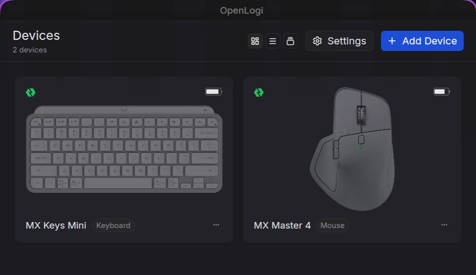

# OpenLogi for Omarchy



OpenLogi plugin: device status in Omarchy's bar and an Action Ring on a Wayland layer-shell surface. The OpenLogi agent still owns HID access, sessions, haptics, and action execution. The shell receives presentation data and sends hover, activate, or cancel commands over a private JSON Lines bridge. The root `preview.webp` is the marketplace cover.

## Install

Requires a packaged OpenLogi installation, a running Omarchy Shell, `rustup` with the selected upstream release's toolchain, `git`, `curl`, `flock`, `jq`, and OpenLogi's build dependencies. The initial build may take a while. Installation does not replace files in `/usr` or change `~/.config/openlogi/config.toml`.

```sh
bash scripts/build-openlogi.sh
bash scripts/install.sh
omarchy-shell alanfrigo.openlogi status
```

The build selects the latest stable upstream release by default, or a release tag passed as its argument, and applies `patches/external-overlay.patch`. Private binaries and upstream licenses live in `~/.local/share/omarchy-openlogi/bin/`; the plugin lives in `~/.config/omarchy/plugins/alanfrigo.openlogi/`. `RELEASE` and `REVISION` record the actual source used, not a required version. The user service and desktop launcher switch to the private binaries. `protocolReady: true` and `agentState: connected` confirm the bridge and agent; an empty device inventory is not an error. The **Logi** bar button opens OpenLogi, and its tooltip reports connection and device status. Configure the Action Ring button and slots in OpenLogi; this plugin does not remap buttons.

The ring appears on the cursor's monitor. Click a slot or use Tab and Enter/Space. Escape or clicking outside cancels. Activation reaches the agent only after the surface unmaps and previous focus is verified. If the monitor, workspace, or previous window disappears, the action is canceled. The bridge and bar can report status even when no ring is open.

## Update

From this repository, update whenever you choose:

```sh
bash scripts/update.sh             # Latest stable upstream release
bash scripts/update.sh v0.8.11     # Specific stable release
omarchy-shell alanfrigo.openlogi status
```

The installed copy also includes `~/.config/omarchy/plugins/alanfrigo.openlogi/scripts/update.sh`. For an in-place marketplace installation, update the plugin source through Omarchy first, then run that script from the installed tree.

Updating builds and tests in staging before switching the service, launcher, and plugin, preserving device configuration and the previous build if compilation or patch application fails. It migrates existing 0.8.10 receipts to the unversioned directory. Managed-file edits remain conflicts, never silently overwritten. A failed switch restores the previous installation; if recovery itself fails, its backup path is printed and retained.

Package updates still work independently, but do not update these private binaries. OpenLogi's graphical updater installs stock upstream artifacts, not this external-overlay patch; local builds also lack its required embedded signing key. Use `update.sh` for the integrated build. New releases must remain compatible with the patch and bridge protocol; incompatibility fails explicitly rather than installing a broken Action Ring. Uninstall restores the packaged backend if you prefer stock OpenLogi updates.

## Uninstall

```sh
bash scripts/uninstall.sh
```

Disables the plugin and restores the previous service and desktop launcher. OpenLogi device configuration stays unchanged. Private binaries are removed only if they match the installation receipt; modified files are preserved, and removal stops on conflicts. The receipt lives at `~/.local/state/omarchy-openlogi/install/`. Installation, update, and removal lock the owned state directory without writing a lock file. If installation fails, inspect the error and receipt before retrying; do not delete receipt files manually.

Local checks: `node check.mjs`, `bash tests/install-lock.sh`, `omarchy plugin validate .`, and `bash -n scripts/*.sh`. `scripts/build-openlogi.sh` runs the Rust tests. Exercising a hardware action requires a configured button and a connected device; protocol tests do not replace that physical check.
